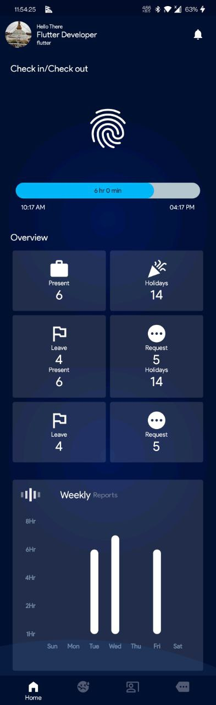
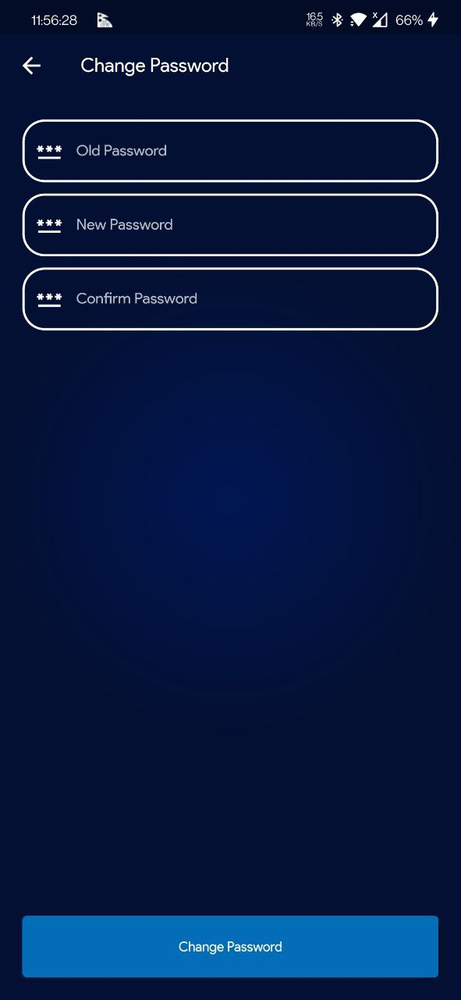
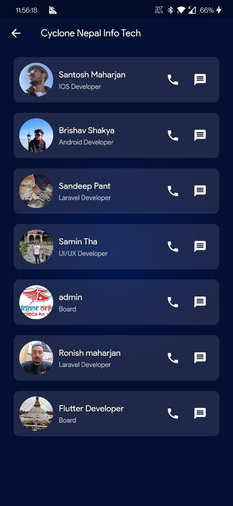

# cnattendance

An attendance application to manage in a organization to check in and check out with multiple functions to manupulate inside a office to record the basic functionality

## Getting Started

The project consist of backend and frontend for an organization to record the attendance of a particular group in a office organization.

Some of the library used in the project:

- [Intl : Provides internationalization and localization facilities, including message translation, plurals and genders, date/number formatting and parsing, and bidirectional text.](https://pub.dev/packages/intl)
- [Table Calendar : Highly customizable, feature-packed calendar widget for Flutter.](https://pub.dev/packages/table_calendar)
- [flutter_svg : Draw SVG (and some Android VectorDrawable (XML)) files on a Flutter Widget.](https://pub.dev/packages/flutter_svg)
- [shared_preferences : Wraps platform-specific persistent storage for simple data (NSUserDefaults on iOS and macOS, SharedPreferences on Android, etc.).](https://pub.dev/packages/shared_preferences)
- [flutter_easyloading  :Easy Loader/Progressbar](https://pub.dev/packages/flutter_easyloading)- [local_auth  :This Flutter plugin provides means to perform local, on-device authentication of the user](https://pub.dev/packages/local_auth)
][olocation  :This plugin for Flutter handles getting a location on Android and iOS. It also provides callbacks when the location is changed.](https://pub.dev/packages/location)
- [flutter_launcher_icons  :A command-line tool which simplifies the task of updating your Flutter app's launcher icon.](https://pub.dev/packages/flutter_launcher_icons)
- [flutter_html  :A Flutter widget for rendering HTML and CSS as Flutter widgets.](https://pub.dev/packages/flutter_html)
- [url_launcher  :A Flutter plugin for launching a URL.](https://pub.dev/packages/url_launcher)
- [dropdown_button2  :Flutter's core Dropdown Button widget with steady dropdown menu and many other options you can customize to your needs.](https://pub.dev/packages/dropdown_button2)
- [lottie  :Lottie is a mobile library for Android and iOS that parses Adobe After Effects animations exported as json with Bodymovin and renders them natively on mobile!](https://pub.dev/packages/lottie)
- [persistent_bottom_nav_bar_v2  :A persistent/static bottom navigation bar for Flutter.](https://pub.dev/packages/persistent_bottom_nav_bar_v2)
- [toggle_switch  :A simple toggle switch widget. It can be fully customized with desired icons, width, colors, text, corner radius, animation etc. It also maintains selection state.](https://pub.dev/packages/toggle_switch)
- [flutter_web_browser  :A flutter plugin to open a web page with Chrome Custom Tabs & SFSafariViewController.](https://pub.dev/packages/flutter_web_browser)
- [percent_indicator  :Circular and Linear percent indicators](https://pub.dev/packages/percent_indicator)
- [device_info_plus : Draw SVG (and some Android VectorDrawable (XML)) files on a Flutter Widget.](https://pub.dev/packages/flutter_svg)
- [flutter_svg : Draw SVG (and some Android VectorDrawable (XML)) files on a Flutter Widget.](https://pub.dev/packages/flutter_svg)
- [provider  : A wrapper around InheritedWidget to make them easier to use and more reusable.](https://pub.dev/packages/provider)
- [expandable   : A Flutter widget that can be expanded or collapsed by the user.](https://pub.dev/packages/expandable)
- [image_picker  : A Flutter plugin for iOS and Android for picking images from the image library, and taking new pictures with the camera.](https://pub.dev/packages/image_picker)
- [network_info_plus   : This plugin allows Flutter apps to discover network info and configure themselves accordingly.](https://pub.de4v/packages/network_info_plus)
- [Permission handler : This plugin provides a cross-platform (iOS, Android) API to request permissions and check their status. You can also open the device's app settings so users can grant a permission.](https://pub.dev/packages/permission_handler)

Some of the screenshots are below:

   

  

  

  

 

  

For help getting started with Flutter development, view the
[online documentation](https://docs.flutter.dev/), which offers tutorials,
samples, guidance on mobile development, and a full API reference.
